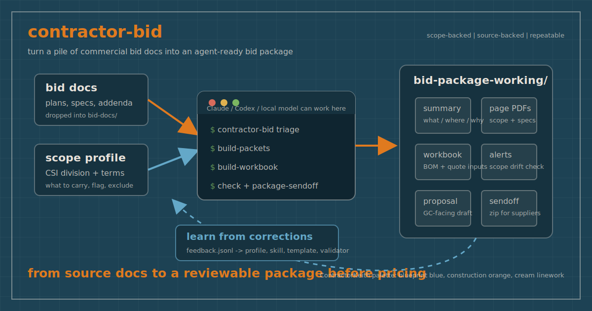

# contractor-bid

[](https://github.com/ContractorKeith/contractor-bid/actions/workflows/ci.yml)
[](https://github.com/ContractorKeith/contractor-bid/actions/workflows/docs.yml)
[](https://github.com/ContractorKeith/contractor-bid/actions/workflows/security.yml)
[](https://github.com/ContractorKeith/contractor-bid/actions/workflows/codeql.yml)

AI-ready bid workspaces for commercial subcontractors.

<!-- Demo GIF slot: docs/assets/demo.gif
     Record with VHS using scripts/demo.tape (30 seconds, the fictional
     fences-gates demo pipeline). Uncomment once recorded and approved:

-->

Install in one command:

```bash
pipx install "contractor-bid[mcp]"   # or: brew install ContractorKeith/tap/contractor-bid
```

> **Status: early access / in active development (v0.2.1).** This is a public testing
> release shared to gather real-world feedback. Expect rough edges, and verify every
> output against the source documents before pricing a real bid. Bug reports and
> contributions are welcome and encouraged. Please
> [open an issue](https://github.com/ContractorKeith/contractor-bid/issues) or see
> [CONTRIBUTING.md](CONTRIBUTING.md).



Commercial bid folders are usually messy: large plan sets, project manuals, addenda, bid forms, scope gaps, and adjacent trades that can accidentally drift into your number. `contractor-bid` gives a subcontractor a repeatable project structure that an AI agent can work inside without losing the audit trail.

If this saves you bid setup time, star the repo so more subcontractors can find it.

It does not price the job for you. It helps turn bid documents into a reviewable package: relevant pages, source-backed summaries, workbook inputs, proposal language, alerts, and a sendoff folder.

Full documentation: [contractorkeith.github.io/contractor-bid](https://contractorkeith.github.io/contractor-bid/)

## Security

`contractor-bid` is a local-first CLI and optional stdio MCP server. It does not run a
hosted service, collect credentials, or send bid documents to ContractorKeith. See
[SECURITY.md](SECURITY.md) for the reporting policy, supported versions, security model,
and current repository security controls.

## What This Repo Does

`contractor-bid` is a Python CLI plus an optional MCP server, agent instructions,
templates, starter trade profiles, and validation checks.

Use it when you want to open Claude, Codex, or another model and say:

```text
Start a new bid project for my electrical scope.
```

The project gives the model a structure to follow:

1. Ask or load the subcontractor's CSI division and scope rules.
2. Create a bid project folder.
3. Put source documents in `bid-docs/`.
4. Triage PDFs for likely scope/spec pages.
5. Build a short page packet and quick-read summary.
6. Build a takeoff/BOM workbook from JSON.
7. Check for missing artifacts, addenda, and scope drift.
8. Package a supplier or internal-review sendoff.
9. Record corrections so the next bid gets better.

## What You Get

Each bid project is built around `bid-package-working/`:

| File | Purpose |
|---|---|
| `00-Bid-Scope-Summary.md` | First-read summary: what it is, what to open first, the packet page map back to source pages, what is excluded, and what needs clarification. |
| `scope-pages.pdf` | Isolated drawing pages relevant to the subcontractor's scope, with outline bookmarks. |
| `spec-pages.pdf` | Isolated spec pages when specs are found. |
| `01-Takeoff-Worksheet-REV1.xlsx` | Workbook with BOM rows, supplier quote inputs, scope summary, RFIs, alerts, and sources. |
| `02 - Proposal Letter.md` | Draft proposal language with inclusions, exclusions, alternates, and clarifications. |
| `ALERTS.md` | Validator output for missing deliverables, due dates, addenda, and excluded/review-only scope terms. |
| `supplier-sendoff/*.zip` | Shareable package for vendors, suppliers, or internal review. |

The pattern comes from real fence/gate bid work. In one package, the workflow produced a scope PDF, a spec PDF, a workbook, alerts, and a supplier zip. In another smaller package, the scope packet was only a few pages and no separate spec packet was needed. The structure stayed the same, which is what lets the model and estimator stay aligned.

More detail: [What A Bid Project Produces](docs/concepts/bid-package.md).

## Who It Is For

- Commercial subcontractors in any CSI division.
- Estimators who want AI help but still need source-backed files.
- Contractors building repeatable bid workflows.
- Developers building trade-specific AI agents for construction.

Canonical starter profiles are included for the active CSI MasterFormat divisions from 03 through 33:

| CSI division | Profile |
|---|---|
| 03 - Concrete | `division-03-concrete` |
| 04 - Masonry | `division-04-masonry` |
| 05 - Metals | `division-05-metals` |
| 06 - Wood, Plastics, and Composites | `division-06-wood-plastics-composites` |
| 07 - Thermal and Moisture Protection | `division-07-thermal-moisture-protection` |
| 08 - Openings | `division-08-openings` |
| 09 - Finishes | `division-09-finishes` |
| 10 - Specialties | `division-10-specialties` |
| 11 - Equipment | `division-11-equipment` |
| 12 - Furnishings | `division-12-furnishings` |
| 13 - Special Construction | `division-13-special-construction` |
| 14 - Conveying Equipment | `division-14-conveying-equipment` |
| 21 - Fire Suppression | `division-21-fire-suppression` |
| 22 - Plumbing | `division-22-plumbing` |
| 23 - Heating, Ventilating, and Air Conditioning (HVAC) | `division-23-hvac` |
| 25 - Integrated Automation | `division-25-integrated-automation` |
| 26 - Electrical | `division-26-electrical` |
| 27 - Communications | `division-27-communications` |
| 28 - Electronic Safety and Security | `division-28-electronic-safety-security` |
| 31 - Earthwork | `division-31-earthwork` |
| 32 - Exterior Improvements | `division-32-exterior-improvements` |
| 33 - Utilities | `division-33-utilities` |

Divisions 15-20, 24, 29, and 30 are reserved in this range, so they are documented but do not get bid starters. More detail: [CSI Division Starters](docs/reference/csi-divisions.md).

The repo also keeps narrower trade-specific examples like `fences-gates`, `concrete-flatwork`, `drywall-framing`, `electrical`, `plumbing`, `hvac`, and `roofing`.

Use `contractor-bid init` when your trade or company rules are different.

## Install

### Recommended: pipx

Install the CLI:

```bash
pipx install contractor-bid
```

Install the CLI plus MCP server for Claude Code, Codex, Cursor, or another MCP-capable agent:

```bash
pipx install "contractor-bid[mcp]"
```

This gives you both:

```bash
contractor-bid doctor
contractor-bid-mcp
```

### Homebrew (macOS / Linux)

```bash
brew install ContractorKeith/tap/contractor-bid
```

The formula installs the core CLI plus Poppler. For the MCP server and agent
plugins, use the pipx install with the `[mcp]` extra above.

### macOS / Linux

From a source checkout:

```bash
git clone https://github.com/ContractorKeith/contractor-bid.git
cd contractor-bid
scripts/install.sh --install-poppler
```

Or use the one-line installer:

```bash
bash -c "$(curl -fsSL https://raw.githubusercontent.com/ContractorKeith/contractor-bid/main/scripts/install.sh)"
```

### Windows PowerShell

```powershell
git clone https://github.com/ContractorKeith/contractor-bid.git
cd contractor-bid
.\scripts\install.ps1 -InstallPoppler
```

The installer creates an isolated virtualenv under `~/.contractor-bid`, installs the CLI there, and writes a launcher to `~/.local/bin/contractor-bid`.

## Prerequisites

Required:

- Python 3.11 or newer
- Git, for install and updates
- `pipx`, for the recommended isolated package install path

Installed automatically into the virtualenv:

- `openpyxl`, for `.xlsx` takeoff workbooks
- `pypdf`, for page packet PDFs and PDF fallback parsing

Recommended system dependency:

- Poppler: `pdfinfo`, `pdftotext`, and `pdftoppm`

Poppler gives faster PDF text extraction and page-image rendering. Without Poppler, basic PDF handling can fall back to `pypdf`, but rendered candidate page images are unavailable. This project does not do OCR yet; scanned image-only plans need OCR before triage works well.

Check a machine:

```bash
contractor-bid doctor
```

No GitHub CLI is required for normal use.

## Agent Plugin Setup

The plugin layer wraps the installed Python engine. Install the engine first:

```bash
pipx install "contractor-bid[mcp]"
```

Claude Code:

```text
/plugin marketplace add ContractorKeith/contractor-bid
/plugin install contractor-bid@contractor-bid
```

Codex and Cursor can reuse the same `contractor-bid-mcp` server and `skills/`. This repo
includes `.mcp.json`, `.claude-plugin/`, `codex-marketplace.json`, and
`.cursor-plugin/` metadata for direct Git-hosted or local install flows.

More detail: [MCP And Agent Plugin Setup](docs/guides/mcp-plugin-setup.md).

## Quick Start

Want a deterministic proof-of-life before touching real bid docs? From a source checkout, copy
the fictional fences/gates sample and run the pipeline:

```bash
mkdir -p /tmp/contractor-bid-demo/bids
cp -R examples/fictional-fences-gates-demo \
  /tmp/contractor-bid-demo/bids/070126-fictional-cedar-park-fence
PYTHONPATH=src python3 -m contractor_bid triage \
  /tmp/contractor-bid-demo/bids/070126-fictional-cedar-park-fence --profile fences-gates
PYTHONPATH=src python3 -m contractor_bid build-packets \
  /tmp/contractor-bid-demo/bids/070126-fictional-cedar-park-fence
PYTHONPATH=src python3 -m contractor_bid build-workbook \
  /tmp/contractor-bid-demo/bids/070126-fictional-cedar-park-fence --profile fences-gates
PYTHONPATH=src python3 -m contractor_bid check \
  /tmp/contractor-bid-demo/bids/070126-fictional-cedar-park-fence --profile fences-gates --today 2026-06-30
PYTHONPATH=src python3 -m contractor_bid package-sendoff \
  /tmp/contractor-bid-demo/bids/070126-fictional-cedar-park-fence
```

The sample uses only fake PDFs and fake quantities. See
[`examples/fictional-fences-gates-demo/README.md`](examples/fictional-fences-gates-demo/README.md)
for what it proves.

Create a workspace for your bids:

```bash
mkdir contractor-bid-workspace
cd contractor-bid-workspace
```

Start a project from a built-in profile:

```bash
contractor-bid new bids/070126-example-project \
  --profile division-32-exterior-improvements \
  --project-name "Example Project" \
  --bid-due "2026-07-01 14:00"
```

Put source PDFs and bid forms in:

```text
bids/070126-example-project/bid-docs/
```

Run the bid workflow:

```bash
contractor-bid triage bids/070126-example-project --profile division-32-exterior-improvements --render --write-sources
contractor-bid build-packets bids/070126-example-project
contractor-bid build-workbook bids/070126-example-project --profile division-32-exterior-improvements
contractor-bid check bids/070126-example-project --profile division-32-exterior-improvements
contractor-bid package-sendoff bids/070126-example-project
```

Triage writes its suggestions to `scope-pages-sources.suggested.json`. Review that file, then
merge the pages you approve into `scope-pages-sources.json` before `build-packets`. The
`--write-sources` flag above only auto-fills `scope-pages-sources.json` while it is still empty;
once it has your content, triage leaves it alone. Triage suggestions are a starting point, not a
pricing decision.

Then open:

```text
bids/070126-example-project/bid-package-working/00-Bid-Scope-Summary.md
```

## Custom Scope Profiles

Run:

```bash
contractor-bid init
```

That writes:

- `profiles/<profile>.json`
- `skills/<profile>-bid-scope/SKILL.md`

The profile defines:

- CSI division and spec section hints.
- Work carried in base bid.
- Search terms that identify the scope.
- Adjacent scope to exclude by default.
- Adjacent scope to flag before pricing.
- Standard proposal exclusions.

The generated skill is for Claude, Codex, or another model to read before making scope calls.

## Test And Lint

For contributors:

```bash
python3 -m pip install -e . ruff
python3 -m unittest discover -s tests
ruff check
```

CI runs the same checks on Python 3.11 and 3.12.

## Learning Loop

Record corrections:

```bash
contractor-bid learn \
  --profile fences-gates \
  --project bids/070126-example-project \
  --note "Flag motor operators separately when electrical power/control responsibility is unclear."
```

The command appends to:

- `.contractor-bid/feedback.jsonl`
- `.contractor-bid/LESSONS.md`

Agents should review those files before similar bids. When a correction becomes a durable rule, update the profile, regenerated skill, templates, or validator.

## Bid Tracker

Track every bid in flight on one readable spreadsheet. The tracker spans the whole workspace, not a single project.

```bash
contractor-bid track-add bids/070126-example-project --progress Triage
contractor-bid track-update "Example Project" --progress Submitted --next "Follow up Friday"
contractor-bid track-move "Example Project" --outcome won
contractor-bid track-list
```

This writes `.contractor-bid/bid-tracker.json` (source of truth) and regenerates `Bid-Tracker.xlsx`:

- **Active Bids**: Project, Location, Due, Progress, Next Action, Client / GC, Updated. Due dates within two days are amber; past-due are red.
- **Archived & Completed**: finished bids move here automatically with an outcome (won, lost, no-bid, completed).

The `bid-tracker` skill lets Claude, Codex, or another agent keep the tracker current as you work, and it asks for confirmation with a change summary before every write. Both tracker files are gitignored so your bid pipeline stays private.

## Architecture

`contractor-bid` is a small, dependency-light Python CLI. The design rule is simple: **JSON files are the source of truth, and the scripts are deterministic glue that turn them into reviewable artifacts.** An AI agent reads the scope profile and skill, fills the JSON, and runs the commands, so every output traces back to a source page or a stated assumption.

### Per-bid data flow

```
profiles/<id>.json  ─┐
bid-docs/*.pdf       ─┴─► triage ──► candidate-pages.md + scope-pages-sources.suggested.json
                                          │
   takeoff/scope-pages-sources.json  ─────┴──► build-packets ──► scope/spec PDFs + 00-Bid-Scope-Summary.md
   takeoff/<project>.json            ──────────► build-workbook ─► 01-Takeoff-Worksheet-REV1.xlsx
                                          │
                              check ──► ALERTS.md ──► package-sendoff ──► supplier-sendoff/*.zip
```

The bid tracker is a separate, workspace-level layer: `.contractor-bid/bid-tracker.json` → `Bid-Tracker.xlsx`.

### Repository layout

```
contractor-bid/
├── src/contractor_bid/      # the CLI package (one module per command area)
│   ├── cli.py               # argparse entrypoint; dispatches each subcommand
│   ├── profile.py           # scope-profile schema + skill generation (render_skill)
│   ├── project.py           # `new`: scaffolds a bid project folder from templates
│   ├── triage.py            # PDF text extraction + candidate-page scoring
│   ├── packets.py           # `build-packets`: scope/spec PDFs + quick-read summary
│   ├── workbook.py          # `build-workbook`: styled takeoff/BOM .xlsx
│   ├── validate.py          # `check` / `status`: deliverable + scope-drift checks
│   ├── sendoff.py           # `package-sendoff`: supplier zip
│   ├── tracker.py           # bid tracker (track-* commands)
│   ├── learning.py          # `learn`: correction/feedback log
│   ├── doctor.py            # `doctor`: environment checks
│   └── util.py              # shared helpers
├── profiles/<id>.json       # built-in scope profiles (one per trade / CSI division)
├── skills/<id>-bid-scope/   # generated agent skills (one per profile)
├── skills/bid-tracker/      # workflow skill for the bid tracker
├── examples/profiles/       # example profiles with sample company names
├── templates/               # project file templates copied by `new`
├── docs/                    # workflow / what-you-get / self-learning docs
├── scripts/                 # install.sh / install.ps1
└── tests/                   # unittest suite (incl. profile round-trip)
```

### Adding a trade or CSI division

A division is three files: `profiles/<id>.json`, the matching `skills/<id>-bid-scope/SKILL.md` (generated from the profile so `tests/test_profile_roundtrip.py` stays green), and `examples/profiles/<id>.json`. Run `contractor-bid init` to generate them interactively, or copy an existing starter and edit the scope terms.

## Limitations

- Not a final pricing engine.
- Not a legal or contract-review tool.
- Not a substitute for manual measurement.
- Not an OCR pipeline for scanned drawings.
- Not a guarantee that every relevant sheet was found.

The intended use is practical: reduce the time between "I received a bid invite" and "I have a source-backed package I can review and price."

## Contributing

See [CONTRIBUTING.md](CONTRIBUTING.md). Public examples should be fictional or sanitized. Do not commit proprietary bid documents, supplier quotes, private estimates, or customer files.

This project follows a [Code of Conduct](CODE_OF_CONDUCT.md).

## License

MIT. See [LICENSE](LICENSE).
